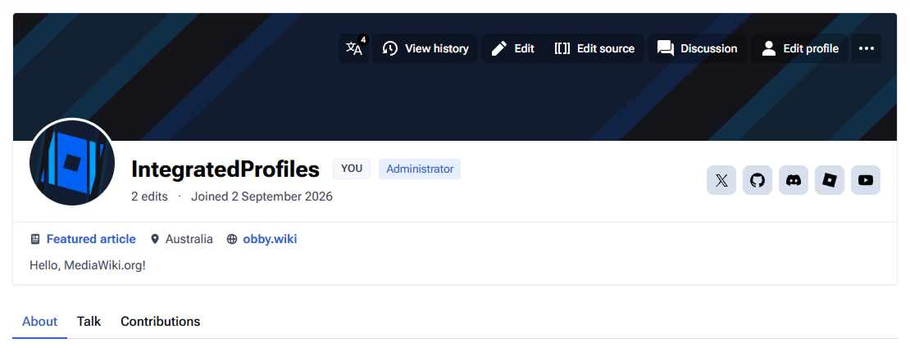

# IntegratedProfiles (Usage)


> Screenshot taken on the Citizen skin while using IntegratedProfiles v0.5.0.

> [!WARNING]  
> IntegratedProfiles is currently in BETA.


IntegratedProfiles implements modern and extensible user profiles with the added focus of integration, meaning any other extension can add onto it.

## Installation

### Requirements

* MediaWiki 1.45 or later
	* Only MW 1.45 and MW 1.46 have been tested. Earlier versions may work but are not officially supported.

### Suggestions

* FloatingUI
* One of the following supported skins: `Citizen`, `Vector-2022` (or any Codex-compatible skin)

### Install

1. Clone into `extensions/IntegratedProfiles`
2. Files are bundled with-in the repo, but, optionally, you can rebuild them manually: `pnpm install && pnpm build`
3. Load in `LocalSettings.php`:

```php
wfLoadExtension( 'IntegratedProfiles' );
```

## Setup

By default, avatars and banners are stored under `{UploadDirectory}/ipavatars` and `{UploadDirectory}/ipbanners` (usually `$IP/images/...`), as `avatar_{id}.{ext}` and `banner_{id}.{ext}`. Profile fields (prefixed with `ip-`) are stored in `user_properties` (preferences). IntegratedProfiles does not touch wikitext, contributions, or anything else.

The `{id}` in those filenames comes from CentralIdLookup, which is either the local user id or the central (`gu_id`) id when CentralAuth is installed.

See below for the required/recommended setup based on your architecture.

### Mutual setup

This setup applies to every setup. If you have not installed FloatingUI, I recommend that you do:

```php
wfLoadExtension( 'FloatingUI' ); # Provides tooltip feedback for certain UI actions (and also enhances mobile support, as users can tap a social link to preview it with a tooltip before opening it).
```

### Single wiki

No extra configuration is needed. The default backend is enough, so simply load the extension:

```php
wfLoadExtension( 'IntegratedProfiles' );
```

Ensure that `$IP/images/avatars` and `$IP/images/banners` are both writable. You can configure a custom FileBackend if you wish, however.

### Wiki farm

You should follow this if you use `CentralAuth`, regardless if you are a farm or not.

Requirements:

* CentralAuth (or another `CentralIdLookup` provider). Using shared user tables instead will (likely) not work.
* Shared file storage.
* The GlobalPreferences extension.

#### Separate upload directories

Register one FileBackend that defines both containers with a constant `domainId`. Paths must resolve to the same storage from every wiki (NFS, a shared volume, or equivalent). Then set `$wgIntegratedProfilesBackend` to that name:

```php
wfLoadExtension( 'CentralAuth' );
wfLoadExtension( 'GlobalPreferences' );
$wgGlobalPreferencesDB = '...';
wfLoadExtension( 'IntegratedProfiles' );

$wgFileBackends[] = [
	'name' => 'ip-shared',
	'class' => \Wikimedia\FileBackend\FSFileBackend::class,
	'domainId' => 'ip-farm', // must be identical on every wiki
	'lockManager' => 'nullLockManager',
	'containerPaths' => [
		'ipavatars' => $IP . '/images/ipavatars',
		'ipbanners' => $IP . '/images/ipbanners',
	],
	'fileMode' => 0644,
];
$wgIntegratedProfilesBackend = 'ip-shared';
```

#### Shared `$wgUploadDirectory`

If every wiki already uses the same upload directory (one `images/` volume), leave `$wgIntegratedProfilesBackend` empty. The default backend uses a stable domain id (`integratedprofiles`), so media is shared without a designated backend. You still need CentralAuth and GlobalPreferences:

```php
wfLoadExtension( 'CentralAuth' );
wfLoadExtension( 'GlobalPreferences' );
$wgGlobalPreferencesDB = '...';
wfLoadExtension( 'IntegratedProfiles' );
```

<!--### Initial setup

If you are using CentralAuth, you should configure a file backend for IntegratedProfiles, including a place for both `ipavatars` and `ipbanners`. This is recommended for expected behavior, and also enables global avatars and banner uploads (truly global banners require GlobalPreferences, see below).

```php
$wgFileBackends[] = [
	'name' => 'ip-shared',
	'class' => \Wikimedia\FileBackend\FSFileBackend::class,
	'domainId' => 'any-domain-id',
	'lockManager' => 'nullLockManager',
	'containerPaths' => [
		'ipavatars' => $IP . '/images/ipavatars',
		'ipbanners' => $IP . '/images/ipbanners',
	],
	'fileMode' => 0644,
];

$wgIntegratedProfilesBackend = 'ip-shared';
```

If CentralAuth is present, files will be stored as `<folder>/central-id`, otherwise `<folder>/local-id`.-->

### Global preferences

This extension is compatible with `GlobalPreferences`. Consider installing this extension alongside IntegratedProfiles, like so:

```php
wfLoadExtension( 'GlobalPreferences' );

$wgGlobalPreferencesDB = '...';
```

See [Extension:GlobalPreferences](https://www.mediawiki.org/wiki/Extension:GlobalPreferences) for more information.

### Suggested extensions

The following extensions are used by IntegratedProfiles in order to achieve full functionality:

```php
wfLoadExtension( 'FloatingUI' ); # Provides tooltip feedback for certain UI actions (and also enhances mobile support, as users can tap a social link to preview it with a tooltip before opening it).
wfLoadExtension( 'CentralAuth' );
wfLoadExtension( 'GlobalPreferences' );
```

## Integrations

Integrations are the whole point of IntegratedProfiles!

### Built-in integrations

IntegratedProfiles integrates certain functionalities from NewAuth. If you have access to NewAuth and have the extension loaded and properly configured, it should work correctly without any configuration. If it does not, please contact me.

### Third-party integrations

* UserFlairs


## Configuration

| Config | Default | Purpose |
|--------|---------|---------|
| `$wgIntegratedProfilesBackend` | `''` | Named entry in `$wgFileBackends`. Empty uses `{UploadDirectory}/ipavatars` and `{UploadDirectory}/ipbanners`. Must already exist if set. See Setup. |
| `$wgIntegratedProfilesEnableUserCards` | `false` | On-click profile cards for username links. Requires FloatingUI. |
| `$wgIntegratedProfilesAboutMaxLength` | `80` | Maximum length in characters for the about tagline. |
| `$wgIntegratedProfilesLinkMaxLength` | `255` | Maximum length in characters for freeform profile link fields. |
| `$wgIntegratedProfilesEnabledSocialLinks` | `['website','twitter','github','discord','roblox','youtube']` | Only accepts one of the presets. Feel free to request or add any. |
| `$wgIntegratedProfilesAvatarMaxBytes` | `2097152` | Maximum avatar upload size in bytes (default 2 MiB). |
| `$wgIntegratedProfilesEnableAnimatedAvatars` | `true` | When false, reject all animated avatar uploads regardless of user rights. Existing GIFs will still be displayed. |
| `$wgIntegratedProfilesBannerMaxBytes` | `4194304` | Maximum banner upload size in bytes (default 4 MiB). |
| `$wgIntegratedProfilesBannerPresetImages` | `[]` | Map of preset ID => image URL (max 8). Replaces gradients on a single wiki, or creates a local extra row with GlobalPreferences per-wiki. |
| `$wgIntegratedProfilesBannerPresetDefault` | `''` | Optional preset ID to use as the single-wiki default. If empty, the first item in `$wgIntegratedProfilesBannerPresetImages` will be used. |
| `$wgIntegratedProfilesLanguageInterwikis` | `[]` | Language interwiki prefixes to inject on user/user talk pages (e.g. ["en","ko","ja"]). Skips the wiki content language and $wgLocalInterwikis. See below. |

### Local settings

Some settings can only be applied globally, as modifying them on one wiki would affect every wiki regardless. The following settings are recommended to be set per-wiki:

* `$wgIntegratedProfilesEnabledSocialLinks`
* `$wgIntegratedProfilesLanguageInterwikis`
* `$wgIntegratedProfilesEnableUserCards`
* `$wgIntegratedProfilesBannerPresetImages`
* `$wgIntegratedProfilesBannerPresetDefault`

The rest should be global or farm-wide.

### Banner preset images

```php
$wgIntegratedProfilesBannerPresetImages = [
	'custombanner1' => '/images/banners/custombanner1.webp',
	'custombanner2' => 'https://static.wiki.local/banner2.webp'
];
$wgIntegratedProfilesBannerPresetDefault = 'custombanner1'; // only useful for single-wiki setups
```

On a single wiki these replace the gradient presets. Users without a custom upload get `$wgIntegratedProfilesBannerPresetDefault` if set, otherwise the first map entry. On a farm they appear below the gradients and only apply on that wiki. Do not set the map globally.

### Social links

```php
$wgIntegratedProfilesEnabledSocialLinks = [ 'website', 'discord', 'roblox' ];
```

While `website` is in the facts strip, it is still controlled by the enabled social links settings.

### User cards

Username links open a profile card on click. This is off by default and requires FloatingUI:

```php
wfLoadExtension( 'FloatingUI' );
$wgIntegratedProfilesEnableUserCards = true;
```

### Language interwikis

You can use $wgIntegratedProfilesLanguageInterwikis to link to language interwikis automatically. Please ensure each language code set here is also registered in the `interwiki` table of **each** wiki (shown on `Special:Interwiki`). No longer locked to Citizen!

```php
$wgIntegratedProfilesLanguageInterwikis = [ 'en', 'ko', 'ja', 'zh' ];
```

Each wiki skips its own content language (`$wgLanguageCode` and `$wgLocalInterwikis`), so you can use the same list everywhere.

**Note**: If a prefix is missing from that wiki’s `interwiki` table, MediaWiki treats `en:User:Name` as a local title and the language menu stays on the current host (`https://ko.wiki.local/en:User:TestUser` instead of `https://wiki.local/User:TestUser`). 

Add both directions, e.g. `en` = `https://wiki.local/$1` and `ko` = `https://ko.wiki.local/$1`.

## Rights

* `integratedprofiles-manage`: Users with this right can edit other users' profile details, including avatars and banners. Granted to `sysop` by default. If settings are shared globally (e.g., via GlobalPreferences), then anyone with this right can edit profile details of a user for every other wiki at once.
* `integratedprofiles-animated-avatar`: Allows users to upload animated (GIF, animated WebP files, or APNG) avatars. Granted to `sysop` by default. Again, with shared avatars, this right on one wiki technically applies to all, as a user can upload an animated avatar on any wiki where they have this right, and that avatar is then used anywhere. This has no effect if `$wgIntegratedProfilesEnableAnimatedAvatars` is set to false.

---

# IntegratedProfiles (Development)

## Hooks

Please see better hook documentation at https://www.mediawiki.org/wiki/Extension:IntegratedProfiles.

## Misc

### Getting avatars

#### For extensions

```php
if ( ExtensionRegistry::getInstance()->isLoaded( 'IntegratedProfiles' ) ) {
	$avatars = MediaWikiServices::getInstance()
		->get( 'IntegratedProfiles.AvatarService' );
	$url = $avatars->get_avatar_url_for_user( $user );
	// Or alternatively, for many users in a batch: $avatars->get_avatar_urls_for_users( $users );
	// (recommended cap: 20)
}
```


#### Action API

You can use the Action API to query user avatars from anywhere else for no more than 50 usernames.

```
action=query&list=integratedprofileavatar&ipauser=Wlft|Wlft2|Wlft3
```
<!-- mitosis? -->

Returns a list of `{ user, avatar_url, has_custom_avatar }`. Unknown names are warned and omitted.

### Getting hover-card payloads

Query quick information about a user's profile.

#### For extensions

```php
if ( ExtensionRegistry::getInstance()->isLoaded( 'IntegratedProfiles' ) ) {
	$profiles = MediaWikiServices::getInstance()
		->get( 'IntegratedProfiles.ProfileService' );
	$card = $profiles->get_card_payload( $user, $viewer );
	// Or alternatively, for many users in a batch:
	// $profiles->get_card_payloads_for_users( $users, $viewer );
}
```

#### Action API

You can query hover-card payloads for no more than 50 usernames.

```
action=query&list=integratedprofilecard&ipcuser=Wlft|Wlft2|Wlft3
```

Returns a list of `{ user, user_id, real_name, about, location, website, edit_count, registration, avatar_url, has_custom_avatar, banner, banner_url, featured_article, is_private }`. `banner` is a preset id (`accent`, `ocean`, `sunset`, `forest`, `midnight`, `ember`, `sand`, `aurora`) or `custom`. `banner_url` is set for a custom upload or a wiki preset image. `featured_article` is `{ title, display_title, url }` or `null`. `website` is `{ label, url }` or `null`. Unknown names are warned and omitted. When `is_private` is true, extras are empty (`banner` falls back to `accent`).

---

# IntegratedProfiles (Contributing)

```bash
pnpm install
pnpm build
pnpm lint
pnpm test
composer install
composer test
```

https://github.com/obbywiki/standards

---

## License

GPL-3.0-or-later

<!-- written by wlft -->
